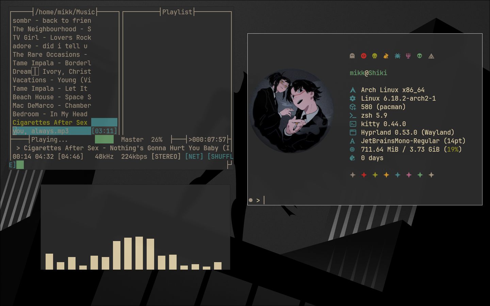
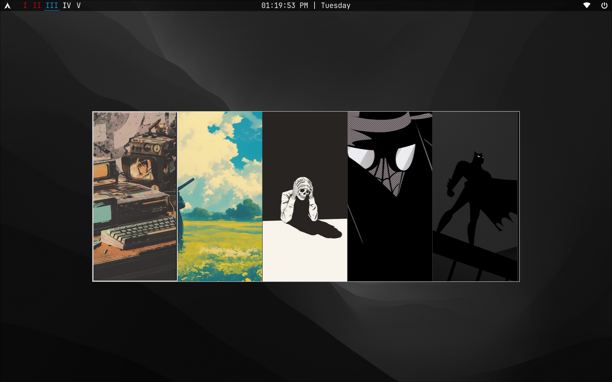
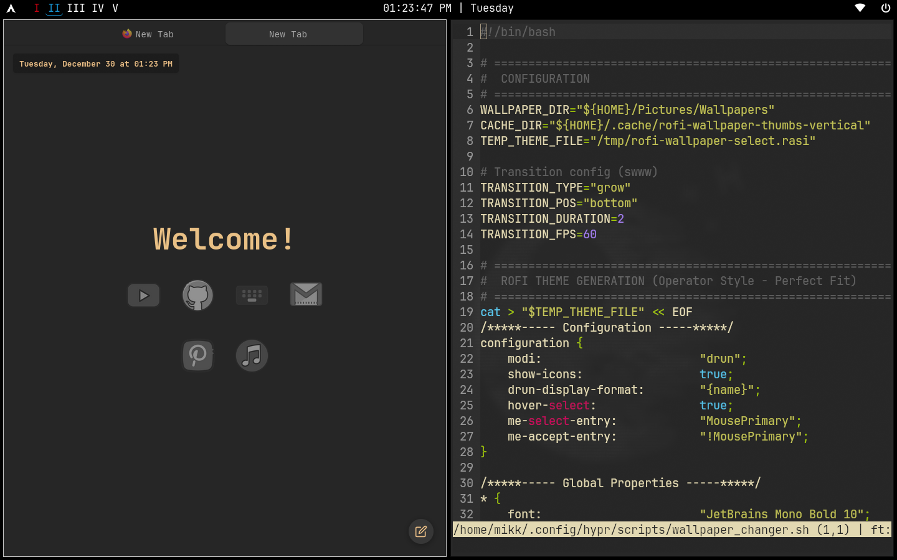
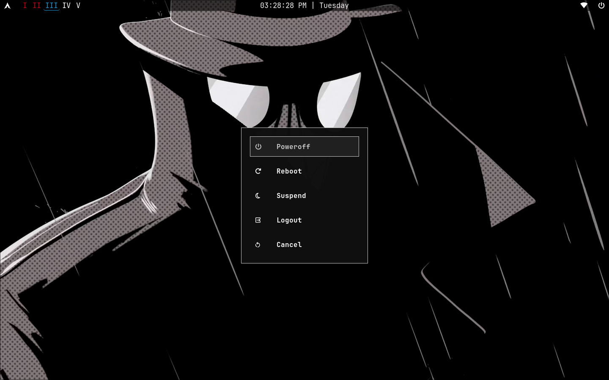
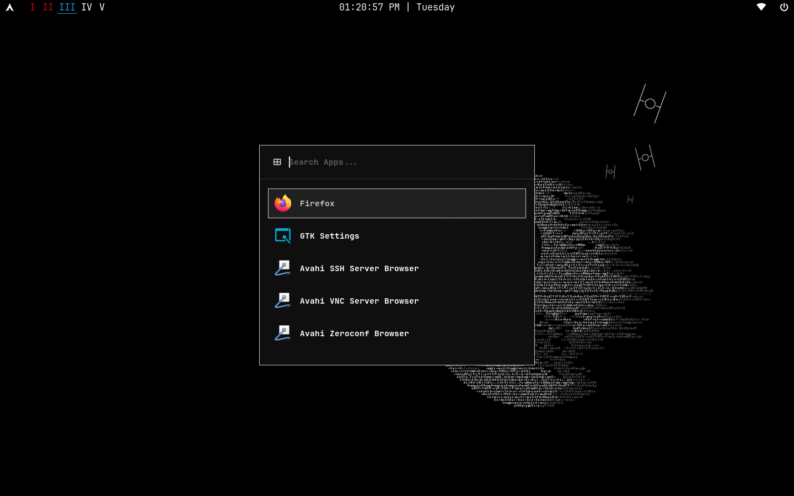
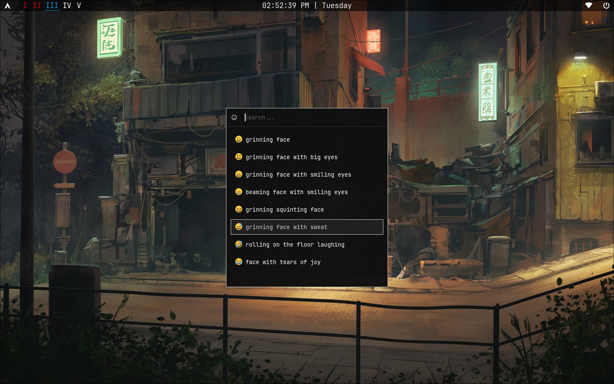
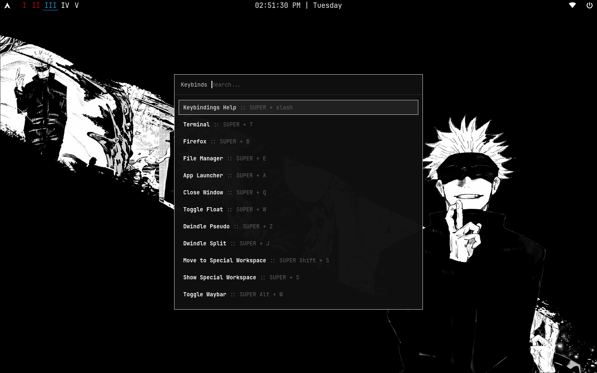

# Hyprdot

This just works for me! Minimal and fast.

<details>
#<summary><b>Preview</b></summary>

<p align="center">
  
  
  
  
  
  
  
</p>

</details>

## Installation

```
git clone --depth 1 https://github.com/coolkidmikk/hyprdot.git ~/hyprdot

cd ~/hyprdot
chmod +x install.sh
./install.sh
```
Keybinding hint: ```Super + /```
Put your wallpaper in ```~/Pictures/Wallpapers/``` and music in ```~/Music```
